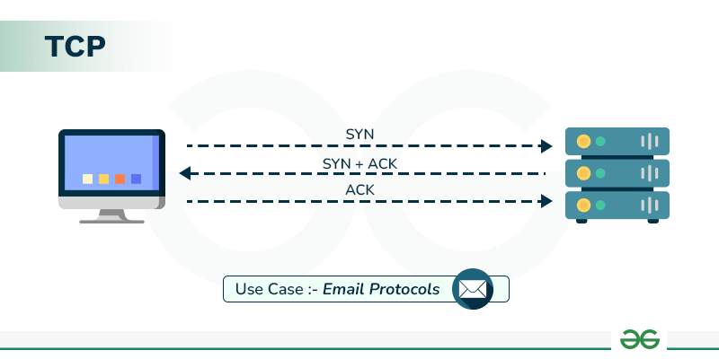
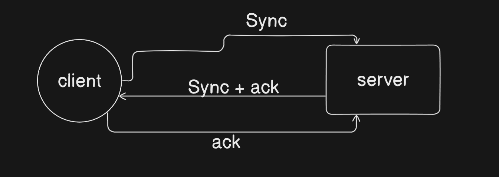

# TCP Handshake and 3 way Handshakes
## NOTE: To view full article click the link - https://hashnode.com/post/cm61t0w8h000p09kwg1cvferf

### What is TCP?

TCP (Transmission Control Protocol) is one of the core protocols of the Internet Protocol Suite, commonly known as TCP/IP. It is responsible for ensuring reliable, ordered, and error-free communication between devices over a network. It operates at the Transport Layer (Layer 4) of the OSI model and is widely used for most types of data transmission, such as web browsing, file transfers, and email.

- Reliable - TCP ensures that each data packets are delivered accurately

- Ordered - Data is transmitted in packets(information jargon), and TCP ensures that packets arrive in the correct order.

- Three-Way Handshake:
Before any data is transmitted, TCP establishes a connection between the sender and the receiver using the following steps:

1. SYN (Synchronize): The sender sends a request to the receiver to initiate the connection.

1. SYN-ACK (Synchronize-Acknowledge): The receiver responds, acknowledging the sender's request and indicating readiness.

1. ACK (Acknowledge): The sender acknowledges the receiver’s response, and the connection is established.

---
### What is UDP?

UDP (User Datagram Protocol) is another core protocol in the Internet Protocol Suite, but it operates differently from TCP. While TCP focuses on reliable, ordered communication, UDP is a simpler, connectionless protocol that prioritizes speed over reliability. It operates at the Transport Layer (Layer 4) of the OSI model, like TCP, but with a different approach to handling data transmission.

- No Reliability - UDP does not guarantee that packets will arrive at their destination, nor does it ensure that they are received in the correct order

- Connectionless - UDP does not establish a connection before sending data

- Faster Data Transmission - Since UDP does not require confirmation or error checking, it transmits data faster, which is beneficial for applications where speed is critical, and occasional data loss is acceptable.

Now, Whom will you wield a sword against for your protection?

well the answer is twofold
