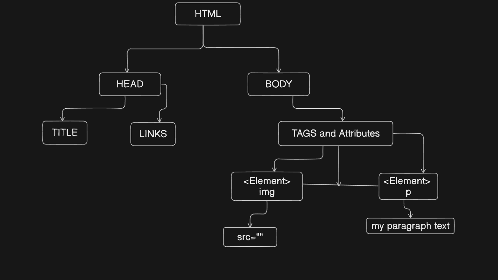
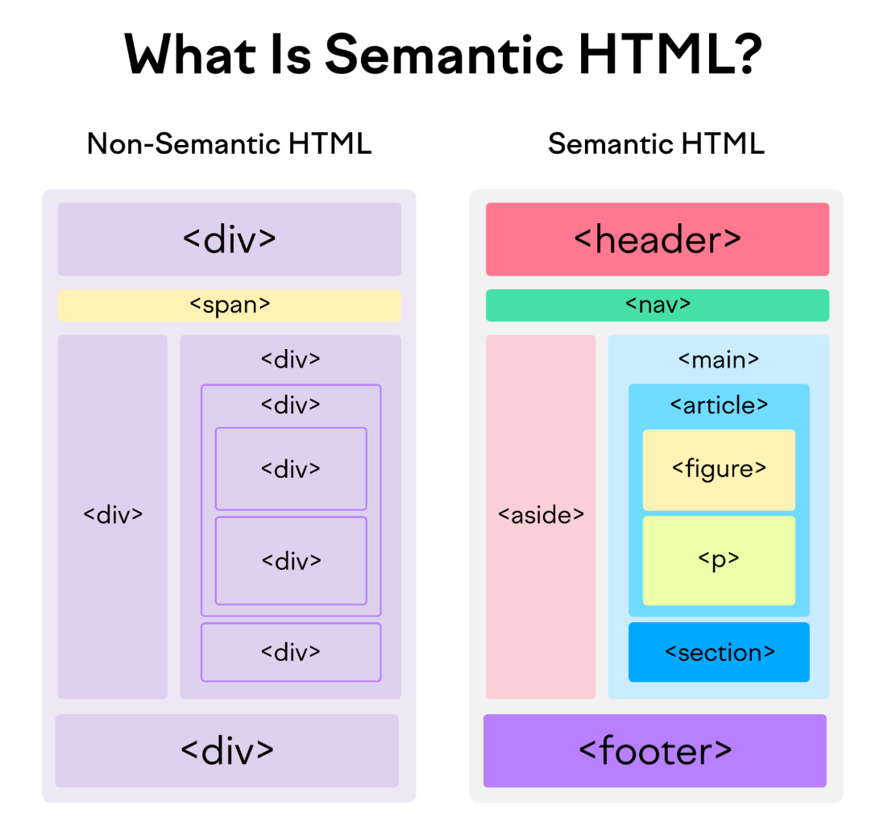
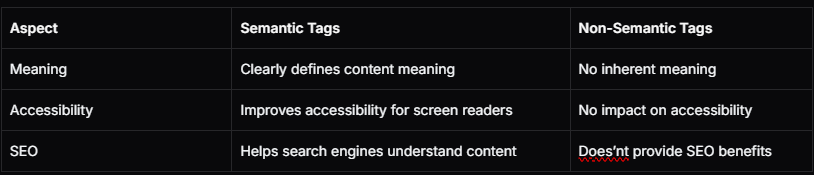

# Phase 1 SpiderMan 
## Topics Covered in Week 02

---

### Introduction
Think about the last website you visited—its foundation is built using HTML, the language that gives structure to the web. To comprehend it more, HTML is like the skeleton of a website. It's a set of instructions that tells a web browser how to display text, images, videos, and other elements on a webpage. Think of it as the building blocks that create the structure and look of a website, similar to how bricks and mortar are used to build a house.

In a nutshell:

- HTML is the language of the web, used to create websites.

- HTML defines the barebone structure or layout of web pages that we see on the Internet.

- HTML consists of a set of tags contained within an HTML document, and the associated files typically have either a ".html" or ".htm" extension.

- There are several versions of HTML, with HTML5 being the most recent version.


### Why the Term HyperText & Markup Language?
The term 'Hypertext Markup Language' is composed of two main words: 'hypertext' and 'markup language.' 'Hypertext' refers to the linking of text with other documents, while 'markup language' denotes a language that utilizes a specific set of tags.

Thus, HTML is the practice of displaying text, graphics, audio, video etc. in a certain way using special tags.

Note: Tags are meaningful texts enclosed in angle braces, like '```<...>'. For``` example, the '```<head```>' tag. Each tag has a unique meaning and significance in building an HTML page, and it can influence the web page in various ways.


### Structure OF HTML


### Semantic & Non-Semantic Tag

**Semantic Tags**

Semantic tags add meaning to your HTML. They tell both the browser and the developer what kind of content is being presented.

Here are some of the key semantic tags you must know about:

```<header>:``` Used to represent the top section of a web page, often containing headings, logos, and navigation.

```<nav>:``` Signifies a navigation menu on a web page.

```<article>:``` Indicates a self-contained piece of content, such as a blog post or news article.

```<section>:``` Represents a thematic grouping of content on a web page.

```<aside>:``` Typically used for sidebars or content that is tangentially related to the main content.

```<footer>:``` Represents the footer of a web page, usually containing copyright information and contact details.

```<figure>``` and ```<figcaption>:``` Used for embedding images, diagrams, or charts, along with a caption.

```<main>:``` Signifies the main content area of a web page.

```<time>:``` Used to represent time-related information, like dates and times




### Key Difference >>
