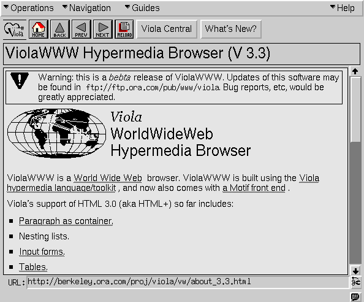

# CSS : Basics  - Styling The Web

## NOTE : To view full article click the link - https://hashnode.com/post/cm687ov71000d09la2hi2937h
 
### Introduction
Visualize a website devoid of color, stripped of font styles and lacking the visual hierarchy that guides users effortlessly through content. Such a website would feel monotonous, difficult to navigate, and uninspiring. This stark image highlights the transformative power of CSS—Cascading Style Sheets—the tool which adds visual aesthetics(jargon) to the webpage. From vibrant color schemes to elegant typography and responsive layouts which gives user a simplified interaction.

Let’s deep dive into the vast ocean of CSS

### Before CSS?

Without a movement forward let’s take a quick flashback.

The basic idea behind css was proposed in 1994 by Håkon Wium Lie later on in 1996- The first version of CSS was invented to enhance the visual aspects of websites. Initially, websites were mainly used by researchers and lacked visual appeal.

As websites became more widespread, the need for better design grew