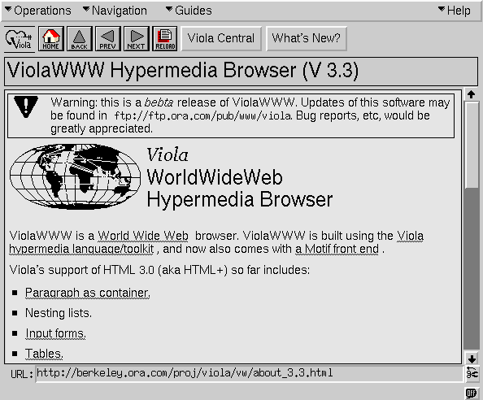
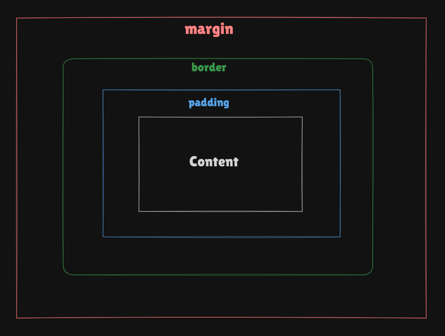

# Phase 1 SpiderMan 
## Topics Covered this week 03

### Introducion
Visualize a website devoid of color, stripped of font styles and lacking the visual hierarchy that guides users effortlessly through content. Such a website would feel monotonous, difficult to navigate, and uninspiring. This stark image highlights the transformative power of CSS—Cascading Style Sheets—the tool which adds visual aesthetics(jargon) to the webpage. From vibrant color schemes to elegant typography and responsive layouts which gives user a simplified interaction.

### Before CSS?
Without a movement forward let’s take a quick flashback.

The basic idea behind css was proposed in 1994 by Håkon Wium Lie later on in 1996- The first version of CSS was invented to enhance the visual aspects of websites. Initially, websites were mainly used by researchers and lacked visual appeal.

### Why the word "cascade"?

The term "cascade" refers to the priority scheme determining which CSS rules are applied when multiple rules target an element. This scheme takes into account specificity and inheritance, ensuring that the most specific and latest rules are applied.

### How does CSS work?

CSS operates by selecting HTML elements and applying styles to them. Styles dictate the appearance of elements on a webpage. You can target HTML elements, classes, or IDs, defining properties like colors, fonts, margins, etc.

### Selectors . , # ?

CSS selectors allow us to choose specific elements and apply styles to them. Suppose we want to add a custom style to only a specific tag(s). There, We can make use of CSS selector.

There are different types of CSS selectors, the two most common are class and id selectors

#### Class Selector

class selector helps group various type of elements. Suppose we want to add a custom style on 10 elements we can give them the same class.

It is written with the period ‘.’ character followed by the class name in the style sheet.

**Note**: We can give multiple classes in one element

#### Id Selector

The id selector does the same job as class selector and an id selector helps in targeting a specific element.

It is written with the hash “#” character followed by the ID name in the style sheet.

**Note**: We cannot give multiple of ids

The syntax of id selector is as follows:

---

To comprehend it more read this analogy - Classroom; multiple students can belong to same class right? to the opposite of it multiple students can belong to one class

let’s say here students are div tags and classrooms are classes

Similar to this every person has it’s own Aadhar number but it cannot belong to multiple peoples

--- 

### CSS Box Model

Now then let’s breakdown CSS box model

The CSS Box model defines how elements are rendered and how their dimensions are calculated.

It describes the structure of an element as a rectangular box that has content, padding, a border, and a margin.

The box model consists of four main components, which are

1. Content: The innermost component of the box model is the actual content of the element. It can be text, image, video, etc.

1. Padding: The space between the actual content and the border of the element is the padding

1. Border: The border surrounds the content and padding and gives the visual border of the element.

1. Margin: Margin is the space which lies outside of the element and separates it from the layout

---
### Calculating the total dimensions of the element

The total width and height of the element is calculated with the formula:

Total Width = Width + Left Padding + Right Padding + Left Border + Right Border + Left Margin + Right Margin

Total Height = Height + Top Padding + Bottom Padding + Top Border + Bottom Border + Top Margin + Bottom Margin

--- 

### Analogy to understand CSS Box Model «//\\»

**Imagine You’re Wrapping a Gift Box**

- The Box (Content): The actual item or gift inside the box is your "content."

- Padding (Bubble Wrap): You add bubble wrap around the gift to protect it.

- Border (Wrapping Paper): You wrap the entire box in decorative wrapping paper.

- Default: box-sizing: content-box (the default behavior)

When you say the gift box is 20 cm wide, you're only talking about the gift inside.

If you add bubble wrap (padding) or wrapping paper (border), the total size of the wrapped gift increases.

**For example:**

Gift width = 20 cm.

Add 2 cm of bubble wrap + 1 cm of wrapping paper.

Total size = 20 cm (gift) + 2 cm (bubble wrap on both sides) + 2 cm (wrapping paper) = 24 cm total width.

After box-sizing: border-box (controlled dimensions)

Now, when you say the gift box is 20 cm wide, it includes the bubble wrap (padding) and wrapping paper (border).

The size of the gift inside adjusts automatically to fit everything within the 20 cm width.

**For example:**

Total size = 20 cm.

Bubble wrap = 2 cm (both sides).

Wrapping paper = 2 cm.

Gift inside = 20 cm - 2 cm (bubble wrap) - 2 cm (wrapping paper) = 16 cm wide.

Now the question arise is why use box-sizing: border-box?

Just like with the gift box, border-box ensures the total size stays consistent, no matter how much padding or border you add. This makes it easier to fit elements into a layout without surprises.

--- 

### Conclusion

The need for CSS lies in its ability to style and enhance the presentation of web pages, making them visually appealing and user-friendly. Understanding CSS fundamentals, such as ID and class selectors, is crucial because they allow you to target specific elements or groups of elements effectively. Each has its own use case—id is for unique, one-off elements, while class can be reused across multiple elements, enabling consistent styling.

Equally important is grasping the CSS box model, which defines how the space around elements is structured. Knowing how to manage the content, padding, borders, and margins will help you create precise and responsive layouts. The box model is the backbone of web design, allowing developers to control element dimensions and positioning accurately.

In summary, mastering these foundational concepts equips developers with the tools to create clean, scalable, and well-designed web pages. By knowing how, when, and why to use CSS selectors and the box model, you can build efficient, maintainable websites that deliver a seamless user experience.

--- 
---
---
### End Notes:

- CSS is a stylesheet language used to control the presentation and layout of web pages. CSS defines how HTML elements should look and behave, including colors, fonts, spacing, positioning, animations, and more.

- Avoid using multiple ids when using for styling classes are more preferrable

- Use id for identifying a single, specific element.

- Don’t use inline styles while it make code more cluttered and difficult to maintain

- Use box-sizing: border-box wherever needed this will help you create better layouts